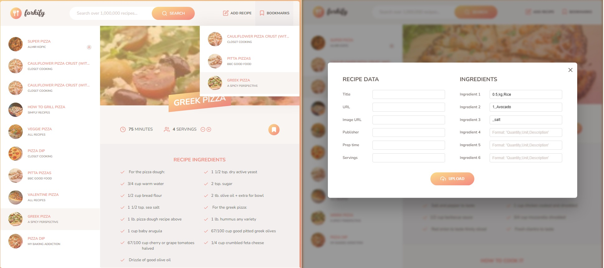

# Forkify

### Recipe App

This is a web application for managing and exploring recipes. Users can search for recipes, view detailed instructions, adjust servings, add recipes to bookmarks, and even upload their own recipes.

### Features
- Search for recipes by keyword
- View detailed recipe instructions and ingredients
- Adjust servings dynamically
- Bookmark favorite recipes for later viewing
- Upload your own recipes to share with the community

### Technologies Used
- JavaScript
- HTML
- CSS
- Webpack - Module bundler
- Babel - JavaScript compiler
  

### Getting Started
To get a local copy up and running follow these simple steps:

1. Clone the repository: `git clone https://github.com/your-username/recipe-app.git`
2. Navigate into the directory: `cd recipe-app`
3. Install dependencies: `npm install`
4. Start the development server: `npm start`

### Contributing
Contributions are what make the open-source community such an amazing place to learn, inspire, and create. Any contributions you make are greatly appreciated.

1. Fork the Project
2. Create your Feature Branch (`git checkout -b feature/AmazingFeature`)
3. Commit your Changes (`git commit -m 'Add some AmazingFeature'`)
4. Push to the Branch (`git push origin feature/AmazingFeature`)
5. Open a Pull Request
